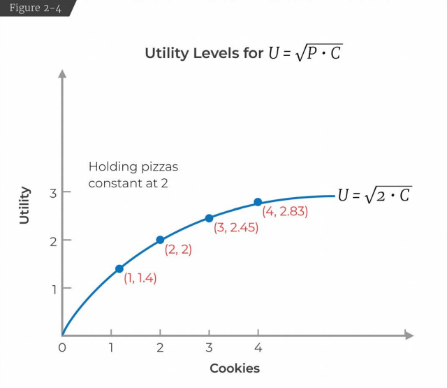
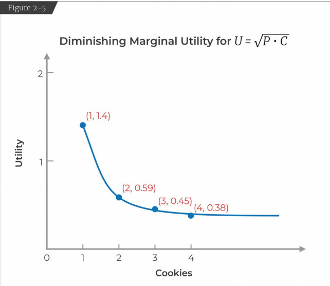
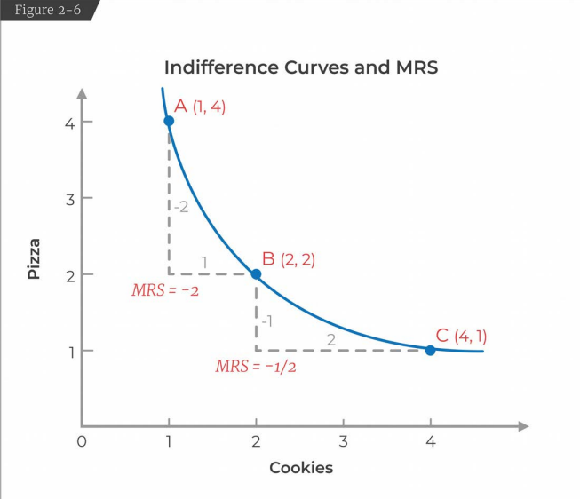
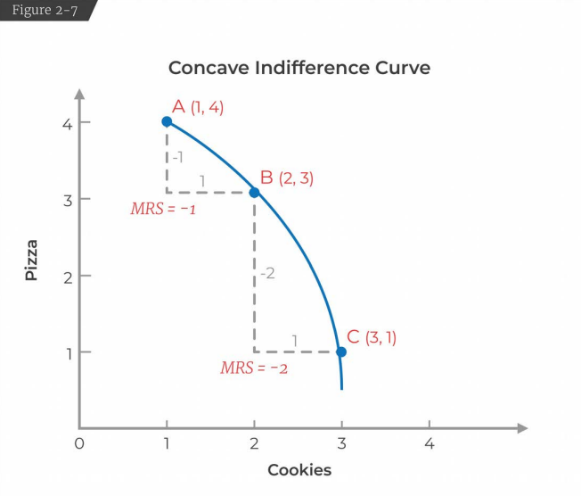

# Lecture 2: Preferences and Utility Functions

* Demand Curve: How consumers make choices
* Supply Curve: How firms make production decisions

* Demand Curve
	* Our model of consumer decision making is going to be a model of utility maximization. 
	* Utility Maximization
		* Consumer Preferences (what they want)
		* Budget Constraint (what they can afford)
	* Constraint Optimization Problem: Maximize people's happiness (given their preference) subject to the budget constraint they face.

* Preference Assumption (we need to simplify the real world to model them mathematically)
	* Completeness
		* You have preferences over any set of goods you might choose from. You can't say I don't know. 
	* Transitivity
		* If you prefer A to B, B to C the you also prefer A to C.
	* Non Satiation (or More is better)
		* We will assume more is always better than less.

* Indifference Curves (graphical representation of preferences)
	* A: 2 pizza, 1 cookie
	* B: 1 pizza, 2 cookie
	* C: 2 pizza, 2 cookie
	* Here, we will assume A and B are indifferent i.e., We get the same happiness (or have the same preference) for 2p,1c and 1p,2c.
	* But, we prefer C more than A and B because of our 3rd preference assumption (more is better).
	
	* How indifference curves work:
		* There is 1 indifference curve between A and B because those are the points among which we are indifferent. 
	* What does Indifference Curve represent:
		* All combination of consumptions among which we're indifferent. 
	* 4 properties of indifference curves:
		* Consumers prefer higher indifference curves. The curve for C is higher than the curve for A and B. This comes from our preference assumption "more is better".
		* Indifference curves are downward sloping. An upward sloping indifference curve which goes through let's say (1,1) and (2,2) violates our assumption "more is better". This is because (2,2) is more than (1,1) but we're saying they're indifferent. 
		
		* Indifference curves never cross. In the figure you will see that B is strictly better than C, but B and C are indifferent by the rule of transitivity. This is a violation. 
		
		* There is only 1 indifference curve (IC) through every bundle. This is kind of similar to property 3. You cannot have 2 indifference curves going through the same bundle. This is because of completeness. If you have 2 indifference curves going through the same bundle then you would not know your exact preferance for a bundle. 
	* Real Life Example:
		* A grad student in economics was trying to decide which job to take. 
		* He had 3 options: Princeton, Santa Cruz, IMF
		* To make this decision he decided to sketch out the indifference curve. 
		* His preferences were: Location of the institute and the Quality of his future colleagues. 
		* Princeton had good economists but the location was bad for a young single male, Santa Cruz had better location but didn't have very good economists. According to him both these jobs were indifferent. 
		* IMF in Washington DC on the other hand had worse colleagues than Princeton and a worse location than Santa Cruz, it was still better in combination of the two of them given his preferences. 
		

* Utility Functions
	* The idea is that every individual has a stable, well behaved, underlying mathematical representation of their preferences. This is called the utility function.   
	* Example: $U = \sqrt{P*C}$, where P is the number of pizza slices and C is the number of cookies.
	* P = 1, C = 2, $U = \sqrt{2}$
	* P = 2, C = 1, $U = \sqrt{2}$
	* P = 2, C = 2, U = 2
	* The utility for the first two choices are similar because they're indifferent whereas the third choice has higher utility. 
	* Utility is not a cardinal concept. It is only an ordinal concept. You can't say my utility is x% higher than your utility. 
	* But utilities can be ranked. It allows us to rank choices. When our choices are spread across multiple dimensions then we can use utility functions to rank our choices.
	* It allows us to weight different elements of our consumption bundle, so we can rank them. 

* Marginal Utility (MU)
	* Marginal Utility is the satisfaction a consumer receives from consuming one more unit of a product or service. 
	* It is the derivative of the utility function with respect to one of the elements. 
	* It describes the change in utility of one unit of a good or service. 
	

* Diminishing Marginal Utility
	* If we keep number of pizza slices constant at 2 and then increase the number of cookies, we see that each additional cookie makes us happier but it makes us less happier than the previous cookie.
	

* Where indifference curves come from?
	* Indifference curves are the graphical representation of what comes out of utility function. 

* Slope of the indifference curve is called the Marginal Rate of Substitution (MRS)
	* The rate at which you're willing to substitute one good for the other.
	* $MRS = \Delta{P}/\Delta{C}$, where P and C are number of pizza slices and cookies respectively
	* In the diagram you will notice that from point A to B we're willing to give up 2 slices of pizza for 1 cookie but from point B to C we're only willing to give up 1 slice of pizza for 2 cookies. This is because of diminishing marginal utility.
	

* How does the MRS relate to the utility function?
	* Marginal Rate of Substitution (MRS) = $\Delta{P}/\Delta{C} = -MU_C/MU_P$, where MU is the Marginal Utility
	* MRS is equal to the -ve of the marginal utility of the good on the x-axis over y-axis.
	* The MRS tells us how our relative marginal utilities evolve as we move down the indifference curve. 
	* #### Marginal Utilities are negative functions of quantity. The more you have a thing, the less you want a next unit of it.
	* When we start at point A, we have lots of pizzas and not a lot of cookies. When you have lots of pizza your marginal utility for pizza is small. But we want more cookies. So, the marginal utility of cookies will be large. $-MU_C/MU_P$ hence will be a large negative quantity because the denominator is small and numerator is large.
	* When we go from point B to C, the number of pizza slices is going from 2 to 1. So, the marginal utility for pizza will be much more than cookies and the MRS will get smaller.
	* As you move along the indifference curve, you're more and more willing to give up the good on the x-axis to get the good on the y-axis.
	* What it implies is that indifference curves are not concave to the origin.
	* In the diagram you will see as we go from A to B, we are giving up 1 slice of pizza to get 1 cookie and from point B to C we are giving up 2 slice of pizza to get 1 cookie. This makes no economic sense. It also violates the law of diminishing marginal utility. 
	

* Real Life Example
	* At starbucks you get a tall iced coffee for $2.25 and the next size (double the previous one) you can get for 70 more cents. At McDonald's a small drink is a $1.22 and for 50 more cents we can double the size. What did these companies give twice as much food for much less than twice as much money?
	* Answer: As we have more coffee available to us the marginal utility is diminishing and we are willing to pay less for the extra. So, companies make the additional coffee cheaper. 

