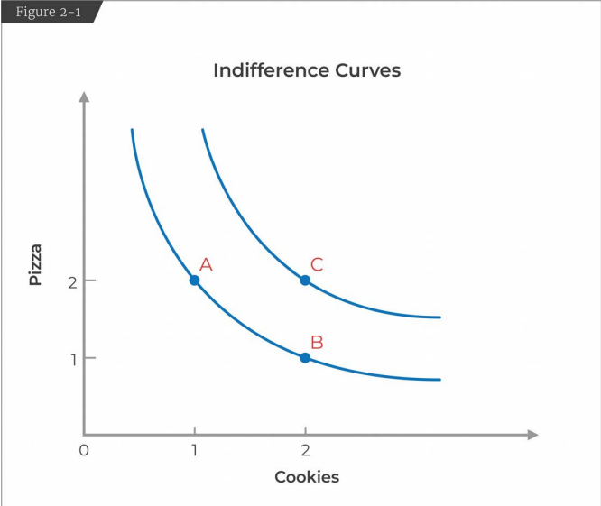
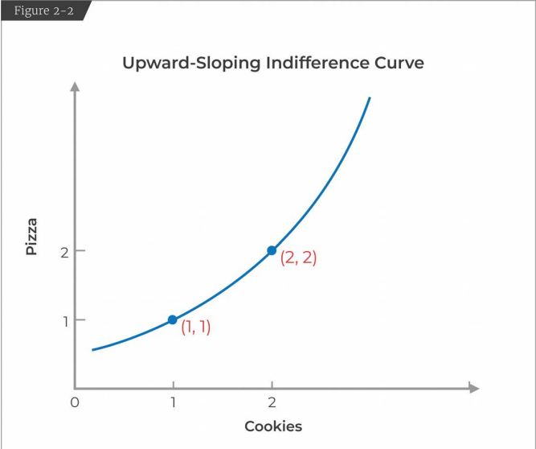
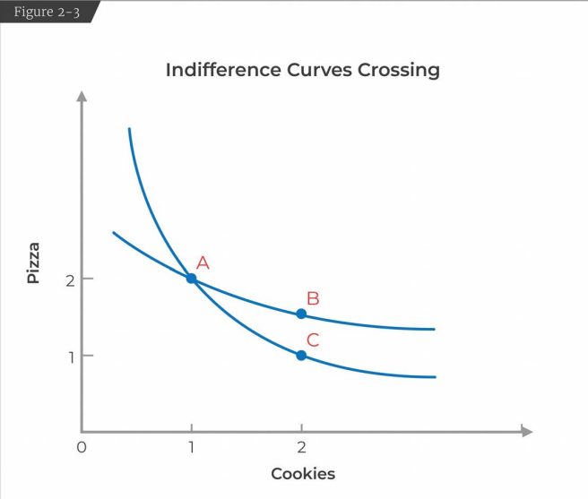
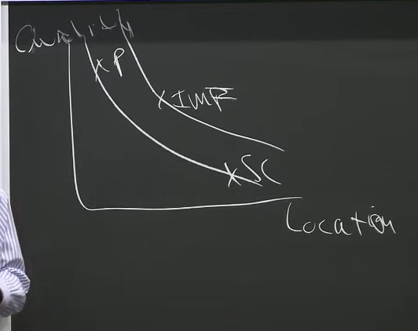

# Lecture 2: Preferences and Utility Functions

* Demand Curve: How consumers make choices
* Supply Curve: How firms make production decisions

* Demand Curve
	* Our model of consumer decision making is going to be a model of utility maximization. 
	* Utility Maximization
		* Consumer Preferences (what they want)
		* Budget Constraint (what they can afford)
	* Constraint Optimization Problem: Maximize people's happiness (given their preference) subject to the budget constraint they face.

* Preference Assumption (we need to simplify the real world to model them mathematically)
	* Completeness
		* You have preferences over any set of goods you might choose from. You can't say I don't know. 
	* Transitivity
		* If you prefer A to B, B to C the you also prefer A to C.
	* Non Satiation (or More is better)
		* We will assume more is always better than less.

* Indifference Curves (graphical representation of preferences)
	* A: 2 pizza, 1 cookie
	* B: 1 pizza, 2 cookie
	* C: 2 pizza, 2 cookie
	* Here, we will assume A and B are indifferent i.e., We get the same happiness (or have the same preference) for 2p,1c and 1p,2c.
	* But, we prefer C more than A and B because of our 3rd preference assumption (more is better).
	* 
	* How indifference curves work:
		* There is 1 indifference curve between A and B because those are the points among which we are indifferent. 
	* What does Indifference Curve represent:
		* All combination of consumptions among which we're indifferent. 
	* 4 properties of indifference curves:
		* Consumers prefer higher indifference curves. The curve for C is higher than the curve for A and B. This comes from our preference assumption "more is better".
		* Indifference curves are downward sloping. An upward sloping indifference curve which goes through let's say (1,1) and (2,2) violates our assumption "more is better". This is because (2,2) is more than (1,1) but we're saying they're indifferent. 
		* 
		* Indifference curves never cross. In the figure you will see that B is strictly better than C, but B and C are indifferent by the rule of transitivity. This is a violation. 
		* 
		* There is only 1 indifference curve (IC) through every bundle. This is kind of similar to property 3. You cannot have 2 indifference curves going through the same bundle. This is because of completeness. If you have 2 indifference curves going through the same bundle then you would not know your exact preferance for a bundle. 
	* Real Life Example:
		* A grad student in economics was trying to decide which job to take. 
		* He had 3 options: Princeton, Santa Cruz, IMF
		* To make this decision he decided to sketch out the indifference curve. 
		* His preferences were: Location of the institute and the Quality of his future colleagues. 
		* Princeton had good economists but the location was bad for a young single male, Santa Cruz had better location but didn't have very good economists. According to him both these jobs were indifferent. 
		* IMF in Washington DC on the other hand had worse colleagues than Princeton and a worse location than Santa Cruz, it was still better in combination of the two of them given his preferences. 
		* 

* Utility Functions
	* The idea is that every individual has a stable, well behaved, underlying mathematical representation of their preferences. This is called the utility function.   
	* Example: $U = \sqrt{P*C}$, where P is the number of pizza slices and C is the number of cookies.
	* P = 1, C = 2, U=$/sqrt{2}$
	* P = 2, C = 1, U=$/sqrt{2}$
	* P = 2, C = 2, U = 2
	* The utility for the first two choices are similar because they're indifferent whereas the third choice has higher utility. 

